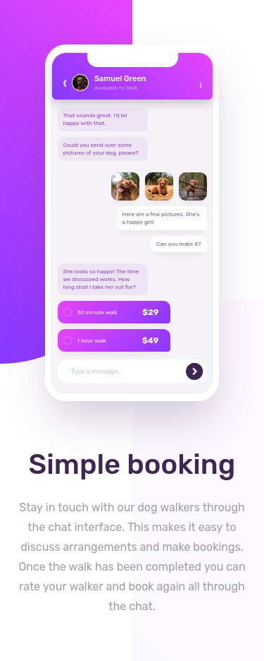

# Frontend Mentor - Chat app CSS illustration solution

This is a solution to the [Chat app CSS illustration challenge on Frontend Mentor](https://www.frontendmentor.io/challenges/chat-app-css-illustration-O5auMkFqY). Frontend Mentor challenges help you improve your coding skills by building realistic projects.

## Table of contents

- [Overview](#overview)
  - [The challenge](#the-challenge)
  - [Screenshot](#screenshot)
  - [Links](#links)
- [My process](#my-process)
  - [Built with](#built-with)
  - [What I learned](#what-i-learned)
- [Author](#author)

## Overview

### The challenge

Users should be able to:

- View the optimal layout for the component depending on their device's screen size

### Screenshot




### Links

- Solution URL: [solution URL](https://your-solution-url.com)
- Live Site URL: [live site URL](https://your-live-site-url.com)

## My process

### Built with

- Semantic HTML5 markup
- Flexbox
- Mobile-first workflow

### What I learned

this was a great project for my css skills, and i've learnt a lot of things, one of them is that the overflow: hidden doesn't work if the content is absolutly positioned, for exmple:

```html
<div class="parent">
  <div class="child"></div>
</div>
```

```css
.parent {
  width: 75vmin;
  height: 75vmin;
  overflow: hidden;
}

.child {
  width: 50vmin;
  height: 100vmin;
  position: absolute;
}
```
then the overflow won't be hidden, i've tried all my best to hide the overflowed part withouth changing the position of the child but that doesn't work, i was obligated to think about another solution which i think is better.

## Author

- Frontend Mentor - [@yassine-ramla](https://www.frontendmentor.io/profile/yassine-ramla)
- Twitter - [@yassine_ramla](https://www.twitter.com/yassine_ramla)